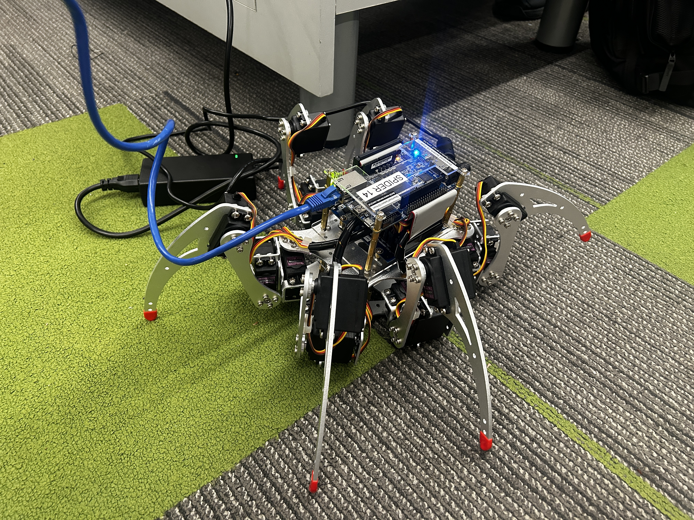

# Embedded Labs
This repo contains the code for serveral of our embedded design labs, this readme contains writeups for them in reverse chronological order

# Lab 10

**Complete Spider Robot Locomotion**

**Click the image above to see a video**

Lab 10 was the apex of this project. Over the previous five labs, we progressed from basic I/O control to servo motor management and coordinated multi-joint systems. In this final lab, we synthesized everything into a fully functional hexapod robot walker.

We implemented a `Spider` class that orchestrates six legs using tripod gait(RF/LM/RB vs LF/RM/LB) for stable, coordinated movement. The system supports multiple locomotion commands:

## Features

- **Gait Control**: Alternating tripod coordination for natural hexapod walking
- **Movement Commands**: Forward, backward, rotate left/right, standup, and reset
- **Speed Control**: Adjustable servo speed (0-100 scale)
- **Interactive CLI**: Real-time command interface for live robot control
- **Pattern Execution**: Pre-programmed patterns (e.g., move in square)

## Commands

- `w` - Move forward
- `s` - Move backward  
- `a` - Rotate left
- `d` - Rotate right
- `p` - Set speed
- `t` - Reset to default stance
- `z` - Execute square pattern
- `q` - Exit program

## Key Accomplishments

- Synthesized lab 6-9 concepts into a cohesive robotic system
- Implemented complex servo coordination across six independent motors
- Demonstrated practical gait algorithms for legged locomotion
- Created robust hardware abstraction through layered class design 

# Lab 9

**Servo Motor Control with Spider Leg Implementation**

This lab reinforced OOP principles by implementing servo motor control and applying it to a spider robot leg system. We created a `Motor` class to handle individual servo control, then built a `SpiderLeg` class composed of three motors (hip, knee, ankle).

## Assignments

1. **Motor Control**: Implemented `Motor` class methods (`Move()`, `SetSpeed()`, `Reset()`, `IsReady()`) to control servo angle and speed. Connected button presses to move three servos in synchronized 15-degree increments, with speed constraints and readiness checks.
2. **Spider Leg Motion**: Built `SpiderLeg` class that manages three motors as a single unit. Implemented `MoveJoint()` to selectively move hip, knee, or ankle, enabling realistic spider leg walking patterns.

## Key Accomplishments

- Developed PWM-based servo control (angle ↔ duty cycle ↔ clock cycles)
- Implemented speed mapping (0-100 scale to 1000-1700 cycle delay)
- Created method chaining and object composition patterns
- Validated motor readiness before accepting new movement commands

Both assignments compiled and ran successfully on the spider robot hardware.

**Seven Segment Display Control with Object-Oriented Programming**

This lab extended our understanding of OOP by creating an inheritance hierarchy to control seven segment displays on the DE1-SoC. We implemented the `DE1` base class, a `SevenSegment` derived class, and an `LEDControl` utility class.

## Parts

1. **Display Count**: Built a `SevenSegment` class with methods to write to individual displays and multi-digit numbers. The program counts from -15,625 to 15,625 (−25³ to 25³) in fifty steps, displaying values on all six seven segment displays.
2. **Button-Controlled Display**: Extended Lab 6's button control functionality to update seven segment displays alongside LEDs. Buttons perform increment, decrement, left shift, and right shift operations on a value loaded from switches.

## Key Accomplishments

- Implemented class inheritance (`SevenSegment` extends `DE1`)
- Developed reusable methods for multi-digit number display
- Leveraged previously built classes to minimize code duplication
- Demonstrated practical OOP design for embedded hardware control

Both programs compiled and ran successfully on the DE1 board.

# Lab 6

**Hardware I/O Control via Embedded Linux C++**

This lab involved controlling physical hardware on the DE1-SoC using embedded Linux and C++. We interacted directly with GPIO memory addresses to read switches/buttons and control LEDs.

## Parts

1. **Read/Write via Terminal**: Implemented user prompts to read individual switches and write to individual LEDs
2. **Bulk Register Control**: Read entire switch register and write to LED register with 10-bit values
3. **Interactive Button Control**: Programmed LEDs to respond to button inputs (increment, decrement, shift, reset counters)
4. **Object-Oriented Redesign**: Refactored code using `DE1` and `LEDControl` classes for cleaner, reusable hardware interfaces

## Key Accomplishments

- Direct register manipulation for hardware control
- Event-driven programming with button inputs
- Demonstrated OOP principles to reduce code duplication and improve maintainability

All programs compiled and ran reliably on the DE1 board.
